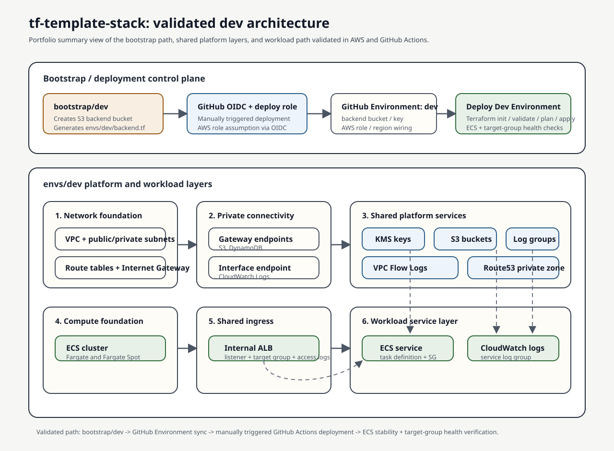

# TF-Template-Stack

A production-shaped Terraform template for building private AWS application platforms using reusable modules, thin environment composition, shared platform services, and ECS-based workload deployment.

This repository demonstrates a module-first Terraform architecture where networking, private connectivity, encryption, storage, logging, DNS, ingress, and ECS workloads are separated into reusable building blocks and composed through lightweight environment root modules.

It is also a portfolio project: the current `dev` path was validated against a real AWS environment and a real GitHub Actions deployment workflow.

---

## Validated Capabilities

- `bootstrap/dev` apply, destroy, and recreate flow validated
- local `envs/dev` apply and destroy validated
- manually triggered GitHub Actions deployment workflow validated
- ECS service stability verified
- ALB target-group health verified
- validation evidence and screenshots included in `docs/`

For the consolidated evidence overview, see:

- [`docs/validation-summary.md`](docs/validation-summary.md)

---

## What this project demonstrates

- modular Terraform architecture with reusable `modules/`
- thin environment composition through `envs/*`
- private-by-default AWS networking patterns
- shared encryption, storage, and logging baselines
- private DNS and shared ALB ingress
- ECS cluster plus Fargate workload deployment
- clear separation between platform, ingress, and workload concerns

---

## Current implementation status

The repository structure supports multiple environments:

- `dev`
- `stage`
- `prod`

At the moment, the full demonstrated implementation is `envs/dev`, covering the platform baseline from network foundation through a private ECS Fargate workload behind a shared internal ALB.

The `stage` and `prod` folders currently remain extension paths for applying the same module pattern to additional environments.

---

## Architecture overview

The current `dev` environment is built in layers so lower-level infrastructure is created first and reused by higher-level modules.

1. **Network foundation**
   - `network`
   - `nat_gateway`

2. **Private connectivity to AWS services**
   - `vpc_gateway_endpoints`
   - `vpc_interface_endpoints`

3. **Shared data protection and logging**
   - `kms_keys`
   - `s3_bucket`
   - `logging_baseline`
   - `vpc_flow_logs`

4. **Private DNS**
   - `route53_private_zones`

5. **Compute foundation**
   - `ecs_cluster`

6. **Shared ingress**
   - `alb_ingress`

7. **Workload service layer**
   - `ecs_fargate_service`

This layered composition keeps responsibilities separated:

- networking modules provide connectivity primitives
- logging and storage modules provide shared platform services
- DNS provides internal name resolution
- compute foundation modules provide the ECS cluster baseline
- ingress modules provide shared load balancing
- workload modules attach services onto the shared platform baseline

---

## Architecture Diagram



---

## Repository structure

- **envs/**: Environment root modules (`dev`, `stage`, `prod`). Each environment composes reusable modules.
- **modules/**: Reusable Terraform modules shared across environments.
- **bootstrap/**: Foundation infrastructure such as remote state backend creation, generated backend configuration, and hardened GitHub Actions deploy-role setup via OIDC. In `dev`, the bootstrap flow is also teardown-friendly for validation and recreation.
- **scripts/**: Local helper scripts such as GitHub Environment synchronization from bootstrap outputs.
- **.github/**: GitHub Actions workflows for validation and manually triggered deployment.
- **docs/**: Runbooks, screenshots, and repository-facing documentation.

---

## Implemented modules

- **network** — VPC + subnets + route tables (no NAT)
- **nat_gateway** — NAT Gateway(s) + private outbound routes
- **vpc_gateway_endpoints** — Gateway endpoints (S3, DynamoDB)
- **vpc_interface_endpoints** — Interface endpoints (PrivateLink services)
- **kms_keys** — Reusable KMS key creation with safe default policy
- **s3_bucket** — Secure-by-default S3 bucket with encryption, lifecycle, and access logging support
- **logging_baseline** — Shared CloudWatch Log Groups with standardized naming, retention, and optional KMS encryption
- **vpc_flow_logs** — VPC Flow Logs delivery to a shared CloudWatch Log Group
- **route53_private_zones** — Private Route53 hosted zones with multi-VPC associations and optional baseline records
- **ecs_cluster** — ECS cluster baseline with Container Insights and capacity provider controls
- **alb_ingress** — Shared internal/public ALB ingress baseline with security groups, listeners, target groups, and optional access logs
- **ecs_fargate_service** — Reusable ECS Fargate service baseline with task definition, service, IAM roles, service security group, CloudWatch logging, and optional target group attachment
- **remote_backend** — Shared S3 remote state backend module for persistence-oriented environments, using lockfile-based state locking

---

## Recommended implementation order

1. `bootstrap/dev`
   - create remote backend (S3 + lockfile-based state locking)
   - set up the GitHub Actions deployment role via OIDC

2. `envs/dev`
   - network baseline
   - NAT Gateway
   - VPC endpoints
   - KMS keys
   - storage baseline
   - logging baseline
   - VPC Flow Logs
   - Route53 private zones
   - ECS cluster baseline
   - ALB ingress baseline
   - ECS Fargate service baseline

This ordering reflects the current implementation path and keeps foundational infrastructure in place before compute and workload layers.

---

## How to run

Start with the `dev` environment.

1. Run `bootstrap/dev` using `bootstrap/dev/README.md` first to:
   - create the remote backend
   - generate `envs/dev/backend.tf`
   - create the GitHub Actions deployment role used for later deployment automation
2. Review `envs/dev/dev.tfvars` and adjust any non-secret desired-state values you want to change
3. Keep backend/auth wiring out of `dev.tfvars`; those stay in bootstrap outputs and GitHub Environment variables
4. Deploy from inside `envs/dev/`:

```shell
terraform init
terraform plan -var-file=dev.tfvars
terraform apply -var-file=dev.tfvars
```

For the detailed walkthroughs, see:

- `bootstrap/dev/README.md` for bootstrap setup, backend lifecycle, and validation evidence
- `envs/dev/README.md` for environment deployment flow, GitHub Environment sync, and operator guidance

The current `dev` bootstrap implementation owns its backend resources directly in `bootstrap/dev` so the environment can be created, validated, destroyed, and recreated cleanly during short-lived AWS validation cycles.
The shared `modules/remote_backend` path remains available for more persistent environments where backend deletion protection is desirable by default.

---

## Current Scope / Limitations

- `dev` is the fully implemented and validated environment
- `stage` and `prod` remain extension paths only
- destroy is manual by design
- the ALB is internal, so workflow smoke checks use AWS-native health signals instead of external HTTP checks from GitHub-hosted runners

---

## Tooling prerequisites

### Core local operator tools

These are the tools a real operator of this repository should have installed locally:

- `git`
- `terraform`
- `aws` CLI

Why `aws` CLI belongs here:

- bootstrap is applied locally against a real AWS account
- local Terraform runs require AWS credentials configured for the target account
- troubleshooting live infrastructure is much easier with AWS CLI access

### Validation and documentation tools

These are recommended when maintaining the repository itself:

- `tflint`
- `terraform-docs`

### GitHub environment sync helper

The local GitHub Environment sync helper requires:

- `python3`
- `gh`

The helper script is:

- `python scripts/sync_github_env.py dev`

It reads `bootstrap/dev` Terraform outputs and syncs only non-secret deployment wiring values into GitHub Environment `dev`.
It does not manage Terraform desired-state inputs such as `TF_VAR_*`.

### Authentication / configuration prerequisites

Before running bootstrap, local Terraform applies, or the GitHub Environment sync helper, make sure:

- AWS credentials are configured locally for the target account
- `gh auth login` has been completed for the target repository

---

## Validation and quality workflow

Recommended checks before merge:

```shell
terraform fmt -recursive
terraform init -backend=false
terraform validate
tflint
terraform-docs
```

GitHub Actions now runs the Terraform validation workflow for pull requests and for pushes to `main`.

The first CI workflow is intentionally focused on safe validation only:

- `terraform fmt -check -recursive`
- `terraform init -backend=false`
- `terraform validate`
- `tflint`

It validates:

- `bootstrap/dev`
- `envs/dev`
- all implemented reusable modules under `modules/`

This keeps CI detached from remote state and AWS credentials while still verifying the real Terraform roots currently implemented in the repository.

The GitHub Actions OIDC role created by `bootstrap/dev` is reserved for future deployment workflows and is not used by the CI validation workflow.

---

## GitHub Actions deployment workflow

The repository now also includes a separate manually triggered deployment workflow for `envs/dev`.

Why this workflow is separate from CI:

- CI validates Terraform code only
- deployment uses the hardened GitHub OIDC role from `bootstrap/dev`
- deployment operates against the real remote backend
- deployment mutates real infrastructure

Current deployment model:

- manual trigger only (`workflow_dispatch`)
- targets `envs/dev` only
- generates `backend.tf` inside the workflow
- uses the tracked `envs/dev/dev.tfvars` file as the shared desired-state source of truth
- uses OIDC to assume the AWS deployment role
- runs Terraform `init`, `validate`, `plan`, and `apply`
- performs AWS-native smoke checks after apply:
  - ECS service stability
  - ALB target group health

Important:

- bootstrap must be run first
- after bootstrap, run the GitHub Environment sync helper:
  `python scripts/sync_github_env.py dev`
- the deployment workflow reads those GitHub Environment variables to regenerate `envs/dev/backend.tf` during execution
- environment desired-state inputs stay in the tracked `envs/dev/dev.tfvars` file, which is shared by local Terraform runs and GitHub Actions deployments
- the internal ALB is not reachable from GitHub-hosted runners
- smoke checks therefore use AWS service state instead of HTTP requests from the runner

Recommended sequence:

1. run `bootstrap/dev` manually
2. sync bootstrap outputs into GitHub Environment `dev` variables for this repository:

```shell
python scripts/sync_github_env.py dev
```

3. optionally review the GitHub Environment `dev` variables in the repository settings
4. manually trigger the `envs/dev` deployment workflow

---

## Design principles

- keep environments thin
- place reusable logic inside modules
- prefer secure-by-default designs
- separate platform, ingress, and workload responsibilities
- avoid deprecated Terraform resources and arguments
- keep the repository beginner-friendly and clearly documented

---

## Environments

- **dev** — fully demonstrated baseline environment
- **stage** — planned extension path
- **prod** — planned extension path

---

## Configuration

See environment-specific `*.tfvars` files in the `envs/` directories.


