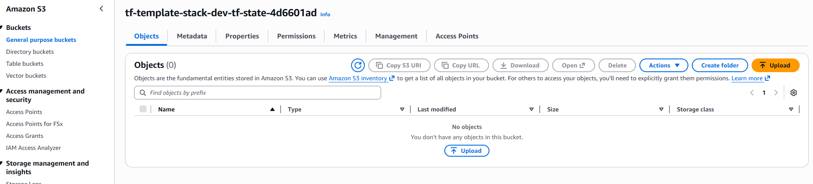
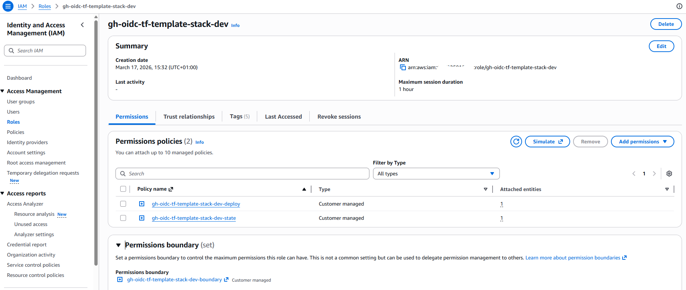
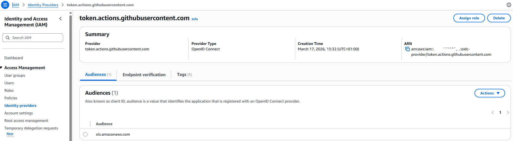

# Bootstrap (dev)

This folder provisions the **foundation infrastructure** for the `dev` environment:

- Terraform remote state storage
- Terraform state locking configuration
- GitHub OIDC identity used for later deployments

It provisions foundational infrastructure required before environment deployments can use remote state and GitHub OIDC authentication.

- **Remote Terraform state backend**
  - S3 bucket for state
  - S3 lockfile-based state locking
- **GitHub Actions OIDC authentication**
  - OIDC provider for GitHub
  - IAM role that GitHub Actions deployment workflows can assume using the configured repo-scoped branch and environment subject patterns

It also **generates `envs/dev/backend.tf` automatically** after apply, so you don’t need to create the backend configuration manually.

### Teardown-friendly dev design

- the Terraform backend resources are defined directly in this root
- the state bucket uses `force_destroy = true`
- the state bucket does not enable S3 versioning
- backend locking now uses the S3 backend lockfile model (`use_lockfile = true`)

This design allows the `dev` bootstrap to be safely applied, destroyed, and recreated during infrastructure validation and experimentation.

Why this root does not use `modules/remote_backend`:

- the shared `remote_backend` module is persistence-oriented and currently hardens the backend against deletion
- that behavior is a better fit for longer-lived environments such as `stage` or `prod`
- for `dev`, the goal is different: create real infrastructure, validate it, and then tear it down cleanly to avoid cost
- Terraform lifecycle protection for backend resources is not something we can safely treat as a simple root-level toggle for this workflow

For that reason, `bootstrap/dev` owns the backend resources directly, while the shared `remote_backend` module remains a better fit for future persistent environments.

---

## What this bootstrap stack is for

Run this stack when you:
- create a new AWS account / new environment
- set up a new infrastructure project
- want GitHub Actions deployment workflows to provision infrastructure using Terraform

You typically run it **once**, but for `dev` it is also valid to destroy and recreate it when testing the full lifecycle.

---

## GitHub Actions OIDC (hardened deployment model)

This stack creates an IAM role for GitHub Actions:

- ✅ Trust is restricted to **your repository** and to the explicit subject patterns used by the current deployment model
- ✅ The current dev deployment path allows:
  - branch-based subject matching for the configured branch
  - environment-based subject matching for GitHub Environment `dev`
- ✅ By default, permissions are separated into:
  - Terraform state bucket access (S3)
  - Terraform state locking through the S3 backend lockfile model
  - deploy permissions for the currently implemented `envs/dev` infrastructure
- ✅ Optional repo-aligned permissions boundary can be attached to the role as a guardrail

Important boundary:

- bootstrap remains **manual**
- the GitHub Actions role is intended for **deployment workflows**, not CI validation
- the validation workflow added in the repository does **not** assume this role

### Legacy admin escape hatch
If you want broad permissions during early prototyping, you can temporarily enable:

- `attach_admin_policy = true`

⚠️ This attaches `AdministratorAccess`. It is kept only as a legacy/prototyping escape hatch and is **not** part of the hardened recommended path.

### Permissions boundary
This stack can also create a **repo-aligned permissions boundary** for the GitHub Actions role.

This boundary is intended as a practical guardrail for this repository's current IAM model. It is still not a substitute for centrally managed organization-wide guardrails in a larger environment.

In the current implementation, the boundary works as:

- a broad allow baseline for normal Terraform and AWS service operations
- explicit deny guardrails for IAM privilege-escalation paths and IAM management outside repo-owned runtime roles and policies

This keeps the deploy role usable for real infrastructure automation while still preserving the intended IAM safety boundaries.

---

## Usage

```sh
cd bootstrap/dev
cp terraform.tfvars.example terraform.tfvars
```
Edit `terraform.tfvars` and set the required values.

This root uses `terraform.tfvars`, so Terraform loads it automatically for:

- `terraform plan`
- `terraform apply`
- `terraform destroy`

At minimum, set:

- `project_name`
- `github_org`
- `github_repo`

Optional values such as `github_branch`, naming overrides, and guardrail toggles can then be adjusted as needed.
If you change the allowed branch/environment trust inputs, re-apply bootstrap before retrying GitHub Actions deployments.

After values are set run:

```sh
terraform init
terraform apply
```

After bootstrap is applied:

- `envs/dev/backend.tf` is generated automatically
- the GitHub Actions deployment role ARN is available as an output
- future deployment workflows can use OIDC to assume the role

The current recommended sequence is:

1. run bootstrap manually
2. confirm `envs/dev/backend.tf` was generated
3. validate destroy and recreate behavior if you are testing a fresh dev account
4. continue with deployment from `envs/dev`

## Validated dev lifecycle

The `dev` bootstrap flow has been validated with this sequence:

1. `terraform apply`
2. verify backend resources exist in AWS
3. `terraform destroy`
4. verify backend resources are removed without manual cleanup
5. `terraform apply` again after full teardown

This confirms that `bootstrap/dev` can be created, destroyed, and recreated without manual bucket cleanup or AWS console intervention.

### Destroy order

When testing teardown:

1. destroy infrastructure from `envs/dev` first
2. destroy `bootstrap/dev` second

Destroying bootstrap first removes the remote state backend and will break further Terraform operations for the environment.

If the backend has already been destroyed accidentally, you must remove the existing `.terraform` directory in `envs/dev` and re-initialize Terraform after recreating the bootstrap stack.

## Example validation evidence (dev bootstrap)

Example validation screenshots for the `dev` bootstrap flow:

### S3 backend state bucket



### GitHub Actions OIDC role



### GitHub OIDC provider



<!-- BEGIN_TF_DOCS -->
## Requirements

| Name | Version |
|------|---------|
| <a name="requirement_terraform"></a> [terraform](#requirement\_terraform) | >= 1.6.0 |
| <a name="requirement_aws"></a> [aws](#requirement\_aws) | >= 6.0.0 |
| <a name="requirement_local"></a> [local](#requirement\_local) | >= 2.5 |
| <a name="requirement_random"></a> [random](#requirement\_random) | >= 3.5 |

## Providers

| Name | Version |
|------|---------|
| <a name="provider_aws"></a> [aws](#provider\_aws) | 6.37.0 |
| <a name="provider_local"></a> [local](#provider\_local) | 2.7.0 |
| <a name="provider_random"></a> [random](#provider\_random) | 3.8.1 |

## Modules

No modules.

## Resources

| Name | Type |
|------|------|
| [aws_iam_openid_connect_provider.github](https://registry.terraform.io/providers/hashicorp/aws/latest/docs/resources/iam_openid_connect_provider) | resource |
| [aws_iam_policy.github_actions_boundary](https://registry.terraform.io/providers/hashicorp/aws/latest/docs/resources/iam_policy) | resource |
| [aws_iam_policy.github_actions_deploy_policy](https://registry.terraform.io/providers/hashicorp/aws/latest/docs/resources/iam_policy) | resource |
| [aws_iam_policy.github_actions_state_policy](https://registry.terraform.io/providers/hashicorp/aws/latest/docs/resources/iam_policy) | resource |
| [aws_iam_policy_attachment.github_actions_admin](https://registry.terraform.io/providers/hashicorp/aws/latest/docs/resources/iam_policy_attachment) | resource |
| [aws_iam_role.github_actions](https://registry.terraform.io/providers/hashicorp/aws/latest/docs/resources/iam_role) | resource |
| [aws_iam_role_policy_attachment.github_actions_deploy](https://registry.terraform.io/providers/hashicorp/aws/latest/docs/resources/iam_role_policy_attachment) | resource |
| [aws_iam_role_policy_attachment.github_actions_state](https://registry.terraform.io/providers/hashicorp/aws/latest/docs/resources/iam_role_policy_attachment) | resource |
| [aws_s3_bucket.terraform_state](https://registry.terraform.io/providers/hashicorp/aws/latest/docs/resources/s3_bucket) | resource |
| [aws_s3_bucket_public_access_block.terraform_state](https://registry.terraform.io/providers/hashicorp/aws/latest/docs/resources/s3_bucket_public_access_block) | resource |
| [aws_s3_bucket_server_side_encryption_configuration.terraform_state](https://registry.terraform.io/providers/hashicorp/aws/latest/docs/resources/s3_bucket_server_side_encryption_configuration) | resource |
| [local_file.backend_config](https://registry.terraform.io/providers/hashicorp/local/latest/docs/resources/file) | resource |
| [random_id.bucket_suffix](https://registry.terraform.io/providers/hashicorp/random/latest/docs/resources/id) | resource |
| [aws_iam_policy_document.github_actions_deploy_permissions](https://registry.terraform.io/providers/hashicorp/aws/latest/docs/data-sources/iam_policy_document) | data source |
| [aws_iam_policy_document.github_actions_state_permissions](https://registry.terraform.io/providers/hashicorp/aws/latest/docs/data-sources/iam_policy_document) | data source |
| [aws_iam_policy_document.github_assume_role](https://registry.terraform.io/providers/hashicorp/aws/latest/docs/data-sources/iam_policy_document) | data source |

## Inputs

| Name | Description | Type | Default | Required |
|------|-------------|------|---------|:--------:|
| <a name="input_attach_admin_policy"></a> [attach\_admin\_policy](#input\_attach\_admin\_policy) | Legacy prototyping-only escape hatch. If true, attach AWS managed AdministratorAccess to the GitHub Actions role. Keep disabled for the hardened deployment model. | `bool` | `false` | no |
| <a name="input_aws_region"></a> [aws\_region](#input\_aws\_region) | AWS region where bootstrap resources will be created. | `string` | `"eu-central-1"` | no |
| <a name="input_common_tags"></a> [common\_tags](#input\_common\_tags) | Additional tags applied to resources. | `map(string)` | `{}` | no |
| <a name="input_create_permissions_boundary"></a> [create\_permissions\_boundary](#input\_create\_permissions\_boundary) | If true, create and attach the repo-aligned permissions boundary to the GitHub Actions role. | `bool` | `true` | no |
| <a name="input_environment"></a> [environment](#input\_environment) | Environment name (dev/stage/prod). Used for naming and for writing env backend.tf. | `string` | `"dev"` | no |
| <a name="input_github_branch"></a> [github\_branch](#input\_github\_branch) | GitHub branch name allowed to assume the GitHub Actions deploy role. | `string` | `"main"` | no |
| <a name="input_github_org"></a> [github\_org](#input\_github\_org) | GitHub organization/user name that owns the repository. | `string` | n/a | yes |
| <a name="input_github_repo"></a> [github\_repo](#input\_github\_repo) | GitHub repository name. | `string` | n/a | yes |
| <a name="input_project_name"></a> [project\_name](#input\_project\_name) | Project name used for naming/tagging. | `string` | n/a | yes |
| <a name="input_state_bucket_name"></a> [state\_bucket\_name](#input\_state\_bucket\_name) | Optional override for the Terraform state S3 bucket name. | `string` | `null` | no |

## Outputs

| Name | Description |
|------|-------------|
| <a name="output_aws_region"></a> [aws\_region](#output\_aws\_region) | AWS region used for bootstrap resources and generated backend configuration. |
| <a name="output_github_actions_role_arn"></a> [github\_actions\_role\_arn](#output\_github\_actions\_role\_arn) | ARN of the IAM role created for GitHub Actions OIDC. |
| <a name="output_github_oidc_provider_arn"></a> [github\_oidc\_provider\_arn](#output\_github\_oidc\_provider\_arn) | ARN of the GitHub OIDC provider. |
| <a name="output_tf_backend_key"></a> [tf\_backend\_key](#output\_tf\_backend\_key) | Canonical backend state key used for the target environment. |
| <a name="output_tf_state_bucket_arn"></a> [tf\_state\_bucket\_arn](#output\_tf\_state\_bucket\_arn) | ARN of the S3 bucket used for Terraform state. |
| <a name="output_tf_state_bucket_name"></a> [tf\_state\_bucket\_name](#output\_tf\_state\_bucket\_name) | Name of the S3 bucket used for Terraform state. |
<!-- END_TF_DOCS -->
